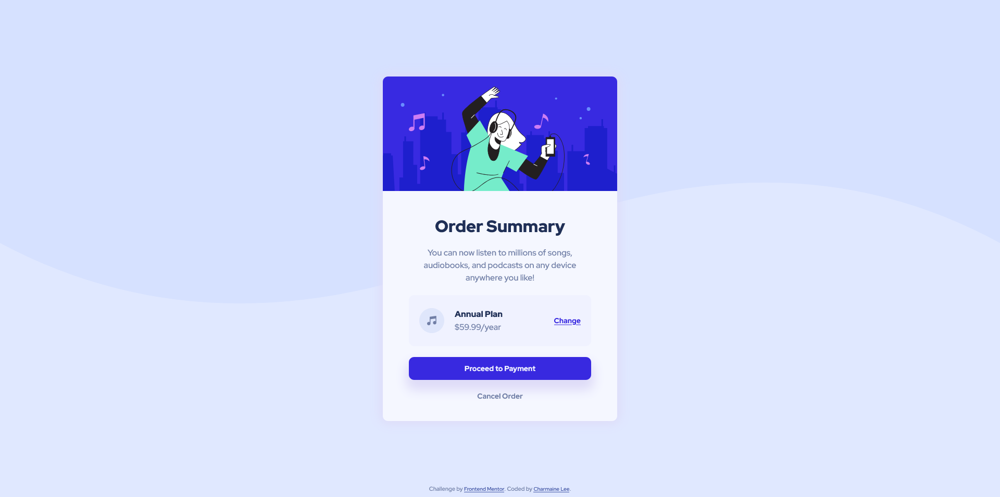

## Table of contents

- [Overview](#overview)
  - [The challenge](#the-challenge)
  - [Screenshot](#screenshot)
  - [Links](#links)
- [My process](#my-process)
  - [Built with](#built-with)
  - [What I learned](#what-i-learned)
  - [Continued development](#continued-development)
  - [Useful resources](#useful-resources)
- [Author](#author)
- [Acknowledgments](#acknowledgments)

## Overview

### The challenge

Users should be able to:

- See hover states for interactive elements

### Screenshot

### Links

- Solution URL: [Add solution URL here](https://your-solution-url.com)
- Live Site URL: [Add live site URL here](https://your-live-site-url.com)

## My process

### Built with

- Semantic HTML5 markup
- CSS custom properties
- Flexbox
- CSS Grid
- Desktop-first workflow

### What I learned

This project gave me the opportunity to plan out the components that need to be built first before diving into the the actual coding, and subsequently testing out my plan to figure out ways to improve it. I started by building the smallest component in the project, and slowly progress to integrating these components into a section of the webpage. This method that was taught to me gave me a clear direction on how I should do my coding and I was able to identify and solve all the issues that arised when building each component before proceeding with the rest of the project. I tried to practice everything I have learnt prior to this project, such as the BEM methodology for structuring my code, and experimented with using the different units of measurement to achieve the result required.

### Continued development

As I continue my journey in learning more about HTML/CSS, I will be focusing on making myself comfortable with using flexbox and grid as these concepts still confuse me when I was working on this project. I am also interested in seeing how an image can be further manipulated to be used as the background of a webpage. Position of an object using CSS is also another hurdle that I wish I can overcome as I continue to practice on it.

### Useful resources

These two amazing teachers that I met on youtube made the completion of this project possible.

- [Mosh Hamedani](https://www.youtube.com/c/programmingwithmosh) - His tutorials taught me many useful concepts that are useful when building a webpage, such as the BEM methodology as mentioned before, and the importance of the workflow for a smoother coding process.
- [Kevin Powell](https://www.youtube.com/kepowob) - His explanations on various important concepts about CSS as such specificity, pseudo-classes and elements are clear and easy to understand. I usually go to his channel when I need a better understanding of certain concepts that I am unsure of.

## Author

- LinkedIn - [Charmaine Lee](https://www.linkedin.com/in/charmainelee-huimin/)
- Frontend Mentor - [@charmainelhm](https://www.frontendmentor.io/profile/charmainelhm)

## Acknowledgments

Practice is a very important learning stage in coding, and I want to thank Frontend Mentor(https://www.frontendmentor.io/) for making it easier for me to do that. With their help, I can focus on understanding the different properties in HTML and CSS even though I have very little knowledge on UI and UX design.
